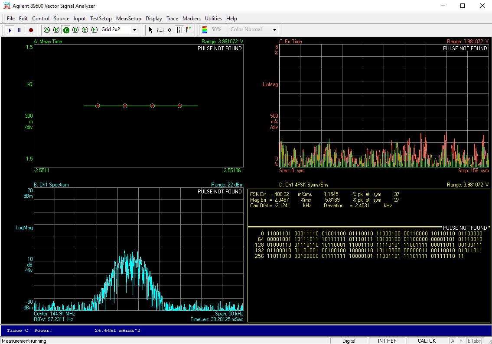
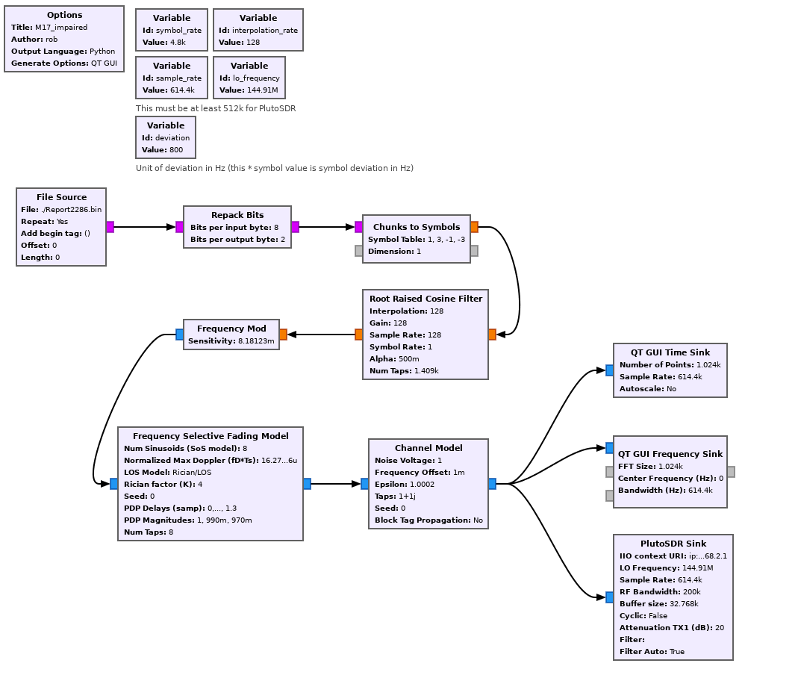
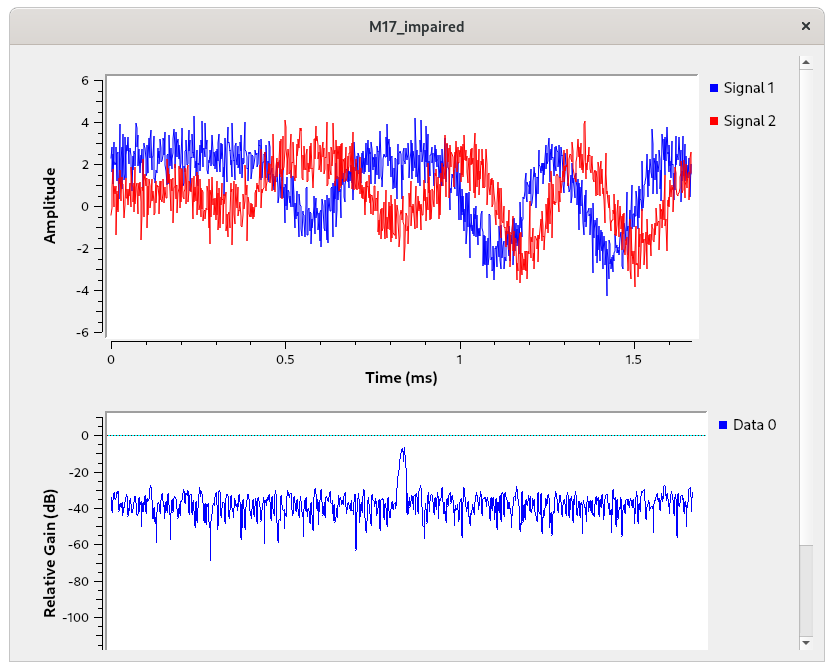

# M17 Gnu Radio Testing

This is a quick 4-FSK flow graph for M17 RF transmit.

Source is a file of M17 type 4 data.

Sink is an ADALM Pluto SDR.

Modify source and sink to suit one's needs.

## Impairment Testing

`M17_impaired.grc` and `M17_impaired.py` an M17 impairment test.  It can
implement Rayleigh or Rician fading models, AWGN, frequency errors, and
timing errors.

Before running this test one should calibrate the transmitter and receiver
so that the transmit and recieve frequencies are precisely aligned.

Adjust the `lo_frequency` variable to the desired transmit frequency.

Replace the sink with whatever is appropriate for your TX hardware.

This uses a rather long audio program to test the receiver.

The impairments can get pretty severe.  This is what a *typical* 
eye diagram of the received baseband signal looks like.

